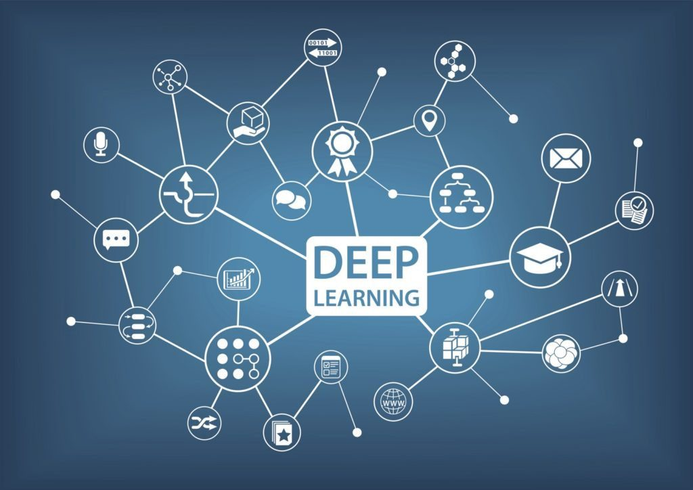
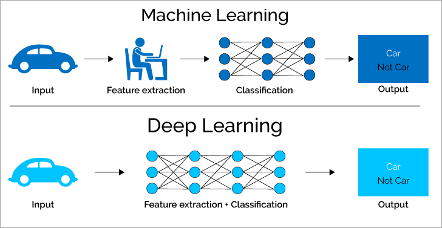

# Machine Learning vs. Deep Learning: Apa Perbedaannya dan Mengapa Itu Penting?

{{date}} · {{author}}

Dalam wacana teknologi saat ini, istilah *Machine Learning* dan *Deep Learning* kerap digunakan secara bergantian—padahal keduanya merujuk pada konsep yang berbeda. Bagi banyak orang, pemahaman yang kabur ini menimbulkan kebingungan. Artikel ini akan menjernihkan perbedaan fundamental antara kedua pendekatan tersebut, menjelaskan kapan masing-masing tepat digunakan, dan mengungkapkan mengapa pemahaman ini menjadi semakin krusial di dunia yang didorong oleh data.

## Definisi: Dua Lapisan dalam Hierarki AI

Sebelum membedah perbedaannya, penting untuk menempatkan kedua konsep dalam hierarki yang tepat. Artificial Intelligence adalah payung terbesar; Machine Learning adalah subset dari AI; dan Deep Learning merupakan subset dari Machine Learning. Seperti yang dikemukakan oleh Andrew Ng, pendiri Google Brain dan mantan chief scientist Baidu:

> *"AI is the new electricity. Just as electricity transformed many industries 100 years ago, AI will do the same. Machine Learning is the most important subset of AI, and Deep Learning is the most advanced form of Machine Learning."*

**Machine Learning** didefinisikan sebagai kemampuan sistem untuk belajar dan meningkatkan performa dari pengalaman tanpa diprogram secara eksplisit. Arthur Samuel, pelopor ML di IBM pada tahun 1959, mendefinisikannya sebagai "bidang studi yang memberi komputer kemampuan untuk belajar tanpa diprogram secara eksplisit."

**Deep Learning**, di sisi lain, adalah pendekatan machine learning yang menggunakan jaringan saraf tiruan dengan banyak lapisan (deep neural networks). Menurut penelitian *Nature* (2015) oleh LeCun, Bengio, dan Hinton—peraih Turing Award 2018—deep learning memungkinkan model belajar representasi data secara bertingkat, dari fitur sederhana hingga abstrak.

## Perbedaan Kunci: Feature Engineering

Perbedaan paling mendasar terletak pada cara kedua pendekatan menangani *feature extraction* (ekstraksi fitur)—proses mengidentifikasi ciri-ciri penting dari data mentah untuk digunakan dalam pembelajaran.

### Machine Learning: Pendekatan Bertahap

Dalam Machine Learning tradisional, ekstraksi fitur biasanya dilakukan **secara manual** oleh para ahli domain (data scientist, engineer). Prosesnya terbagi menjadi langkah-langkah yang jelas:

- **Input** → Data mentah (gambar, teks, angka) dimasukkan ke dalam sistem
- **Feature extraction** → Ahli manusia merancang dan memilih fitur-fitur yang relevan (misalnya: edge detection untuk gambar, n-gram untuk teks)
- **Classification/Regression** → Model ML mempelajari pola dari fitur yang sudah diekstraksi
- **Output** → Hasil prediksi atau klasifikasi

Keterbatasan utama: *"Garbage in, garbage out."* Jika fitur yang dipilih lemah atau tidak representatif, performa model akan terbatas—terlepas dari seberapa canggih algoritma klasifikasinya.

### Deep Learning: Pendekatan End-to-End

Deep Learning mengintegrasikan **ekstraksi fitur dan klasifikasi dalam satu proses otomatis**. Jaringan saraf dalam (dengan banyak lapisan tersembunyi) belajar secara hierarkis:

- Lapisan awal mengenali fitur dasar (edges, tekstur, bentuk sederhana)
- Lapisan tengah menggabungkan menjadi konsep menengah (objek parsial, pola kompleks)
- Lapisan akhir menghasilkan representasi abstrak untuk keputusan akhir

Seperti dijelaskan dalam paper seminal *"Deep Learning"* (Nature, 2015):

> *"Deep-learning methods are representation-learning methods with multiple levels of representation, obtained by composing simple but non-linear modules that each transform the representation at one level into a representation at a higher, slightly more abstract level."*

## Kapan Menggunakan Masing-Masing?

### Gunakan Machine Learning ketika:

- **Data terstruktur dan relatif kecil** (ribuan hingga ratusan ribu sampel)
- **Domain sudah dipahami dengan baik**—Anda tahu fitur apa yang relevan
- **Sumber daya komputasi terbatas**—ML tradisional lebih efisien
- **Interpretabilitas penting**—model seperti decision tree atau linear regression mudah dijelaskan
- **Contoh aplikasi:** Prediksi churn pelanggan, klasifikasi spam, deteksi penipuan, rekomendasi produk berbasis collaborative filtering

### Gunakan Deep Learning ketika:

- **Data tidak terstruktur dan masif** (gambar, audio, teks, video)
- **Fitur sulit didefinisikan secara manual**—misalnya, apa yang membuat wajah "senang"?
- **Komputasi GPU tersedia**—training membutuhkan daya komputasi tinggi
- **Akurasi tertinggi adalah prioritas**—terutama untuk tugas seperti pengenalan objek atau terjemahan mesin
- **Contoh aplikasi:** Pengenalan wajah, asisten virtual, kendaraan otonom, diagnosa medis dari citra radiologi

## Perspektif Para Ahli

**Dr. Fei-Fei Li**, profesor Stanford dan co-director Stanford Institute for Human-Centered AI, menekankan:

> *"Machine Learning adalah fondasi, tetapi Deep Learning membuka pintu untuk masalah yang sebelumnya dianggap mustahil—seperti memahami kandungan visual dari miliaran gambar di internet."*

**Geoffrey Hinton**, salah satu "Godfathers of AI," dalam wawancara dengan *Wired* (2023) menyatakan:

> *"The key insight of deep learning is that we can learn good representations. Instead of hand-crafting features, we let the data teach the model what to look for."*

**Sebastian Raschka**, penulis *Machine Learning with PyTorch and Scikit-Learn*, mengingatkan bahwa pilihan tidak selalu hitam-putih:

> *"Deep Learning bukan pengganti machine learning tradisional—itu alat tambahan. Untuk banyak masalah bisnis, gradient boosting atau random forest tetap lebih praktis dan hemat sumber daya."*

## Mengapa Pemahaman Ini Penting?

### Bagi Profesional Teknologi

- **Memilih stack teknologi yang tepat** menghindari over-engineering atau under-utilization
- **Estimasi proyek**—Deep Learning membutuhkan waktu dan biaya lebih besar untuk data preparation, training, dan iterasi
- **Komunikasi dengan stakeholder**—menjelaskan mengapa solusi X lebih cocok daripada Y

### Bagi Pengambil Keputusan Bisnis

- **ROI dan resource allocation**—tidak setiap masalah memerlukan neural network
- **Risk management**—model yang lebih sederhana sering kali lebih mudah diaudit dan memenuhi regulasi
- **Strategi AI perusahaan**—memetakan kapan build vs. buy, kapan ML vs. DL

### Bagi Masyarakat Umum

- **Literasi teknologi**—memahami berita dan diskusi tentang AI dengan kritis
- **Ekspektasi realistis**—menghindari hype berlebihan atau ketakutan yang tidak berdasar

## Ringkasan Perbandingan

| Aspek | Machine Learning | Deep Learning |
|-------|------------------|---------------|
| Ekstraksi fitur | Manual (oleh manusia) | Otomatis (oleh model) |
| Volume data | Ribuan–ratusan ribu | Jutaan+ ideal |
| Komputasi | CPU sering cukup | GPU/TPU disarankan |
| Interpretabilitas | Relatif tinggi | Relatif rendah (black box) |
| Waktu pengembangan | Lebih cepat | Lebih lama |
| Aplikasi khas | Data terstruktur, tabular | Gambar, suara, teks, video |

## Kesimpulan

Machine Learning dan Deep Learning adalah dua pendekatan komplementer dalam ekosistem AI—bukan pesaing. Machine Learning tetap menjadi pilihan utama untuk banyak masalah praktis yang melibatkan data terstruktur dan kebutuhan interpretabilitas. Deep Learning unggul di domain yang membutuhkan pemahaman pola kompleks dari data tidak terstruktur dalam skala besar.

Seperti yang disimpulkan dalam laporan McKinsey *"The State of AI in 2023"*: *"Organizations that succeed with AI are those that match the right technique to the right problem—not those that blindly adopt the latest deep learning architecture."*

Pemahaman mendalam tentang perbedaan ini memungkinkan kita membuat keputusan yang lebih cerdas, baik sebagai praktisi, pemimpin bisnis, maupun masyarakat yang hidup di era transformasi digital.

## Referensi

- LeCun, Y., Bengio, Y., & Hinton, G. (2015). *Deep learning.* Nature, 521(7553), 436-444.
- Goodfellow, I., Bengio, Y., & Courville, A. (2016). *Deep Learning.* MIT Press.
- McKinsey Global Institute. (2023). *The State of AI in 2023: Generative AI's Breakout Year.*
