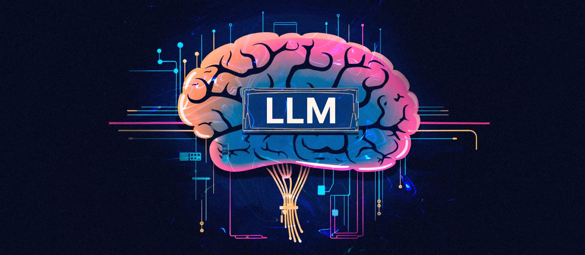
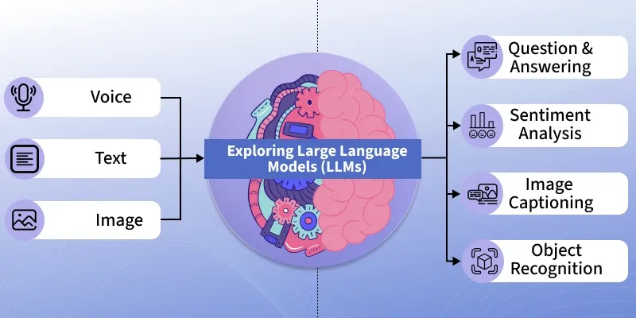

# Mengenal Large Language Models (LLM): Bagaimana Mesin Bisa Memahami Bahasa Manusia?

{{date}} · {{author}}

Ketika ChatGPT diluncurkan pada akhir 2022, dunia menyaksikan sebuah terobosan: mesin yang dapat berdialog layaknya manusia, menulis puisi, menyusun kode program, dan menjawab pertanyaan kompleks. Di balik kemampuan tersebut terdapat teknologi bernama **Large Language Models (LLM)**—model bahasa berskala besar yang menjadi fondasi revolusi AI generatif. Artikel ini mengajak Anda memahami bagaimana mesin dapat "memahami" bahasa manusia dan mengapa perkembangan LLM menjadi momen bersejarah dalam kecerdasan buatan.

## Apa itu Large Language Models?

Large Language Models adalah model kecerdasan buatan yang dilatih pada data teks dalam jumlah masif—sering kali triliunan token dari buku, artikel, website, dan percakapan. Dengan arsitektur berbasis *transformer* (diperkenalkan Google dalam paper *"Attention Is All You Need"* tahun 2017), LLM mampu menangkap hubungan kontekstual antar kata dalam kalimat, memahami nuansa makna, dan menghasilkan teks yang koheren.

Berbeda dengan program berbasis aturan yang mengandalkan kamus dan tata bahasa eksplisit, LLM belajar pola bahasa secara statistik dari data. Mereka memprediksi kata atau token berikutnya yang paling probable berdasarkan konteks—suatu kemampuan yang, dalam skala besar, tampak seperti "pemahaman" mendalam terhadap bahasa.

## Bagaimana LLM Belajar?

Proses pembelajaran LLM dapat disederhanakan dalam beberapa tahap:

1. **Pre-training** — Model membaca teks dalam volume besar dan belajar memprediksi kata yang disembunyikan (masked language modeling) atau kata berikutnya (next-token prediction). Dari sini, model menangkap tata bahasa, fakta umum, dan pola penalaran.
2. **Fine-tuning** — Model disesuaikan pada tugas atau domain spesifik, seperti menjawab pertanyaan, menulis kode, atau terjemahan.
3. **Alignment** — Teknik seperti RLHF (Reinforcement Learning from Human Feedback) membuat output model lebih aman, membantu, dan sesuai preferensi manusia.

Seperti diungkapkan oleh Sam Altman, CEO OpenAI:

> *"These models don't 'understand' in the human sense—they predict. But the quality of prediction at scale creates something that looks remarkably like understanding."*

## Arsitektur Transformer: Kunci Keberhasilan LLM

Komponen utama LLM adalah **attention mechanism**—mekanisme yang memungkinkan model "memperhatikan" bagian-bagian relevan dari input saat memproses setiap token. Dengan attention, model dapat menangkap hubungan jarak jauh antar kata, misalnya menghubungkan kata ganti "ia" dengan subjek yang tepat beberapa kalimat sebelumnya.

Arsitektur transformer terdiri dari lapisan encoder dan/atau decoder. Model seperti GPT menggunakan decoder-only (memprediksi teks从左 ke kanan), sementara BERT menggunakan encoder-only (memahami konteks penuh). Variasi seperti T5 dan LLaMA memilih konfigurasi berbeda sesuai tujuan desainnya.

## LLM dalam Berbagai Modalitas: Teks, Suara, Gambar, dan Lainnya

Perkembangan terbaru memperluas LLM melampaui teks. Model **multimodal** seperti GPT-4V, Claude, dan Gemini dapat memproses:

- **Teks** — Pemahaman, generasi, terjemahan, summarisasi
- **Suara** — Transkripsi (Whisper), text-to-speech, pengenalan emosi
- **Gambar** — Analisis visual, menjawab pertanyaan tentang gambar, generating image descriptions

Integrasi berbagai modalitas memungkinkan asisten AI yang lebih natural—misalnya, Anda bisa mengirim foto masakan dan bertanya resepnya, atau mendikte pesan dengan suara dan mendapatkan jawaban tertulis. Perbatasan antara "mesin teks" dan "mesin yang memahami dunia" semakin kabur.

## Aplikasi Praktis LLM

LLM telah diterapkan di berbagai bidang:

- **Asisten virtual** — ChatGPT, Claude, Gemini, dan sejenisnya untuk tugas harian
- **Pemrograman** — GitHub Copilot, Cursor, dan tools coding berbasis AI
- **Pendidikan** — Tutor personal, pembuatan materi ajar, latihan soal
- **Bisnis** — Customer service otomatis, penulisan konten, analisis dokumen
- **Riset** — Literature review, sintesis informasi, pembuatan hipotesis

## Tantangan dan Pertimbangan Etis

Di balik kemampuan luar biasa, LLM menghadapi sejumlah tantangan:

| Tantangan | Deskripsi |
|-----------|-----------|
| Hallucination | Model kadang menghasilkan informasi yang terdengar meyakinkan tetapi salah |
| Bias | Pola bias dalam data pelatihan dapat teramplifikasi dalam output |
| Keberlanjutan | Konsumsi energi dan sumber daya untuk training dan inferensi sangat besar |
| Privasi | Data sensitif mungkin bocor melalui output atau tersimpan dalam model |

Pengembangan LLM yang bertanggung jawab memerlukan transparansi, evaluasi yang ketat, dan kolaborasi antara peneliti, regulator, dan masyarakat.

## Masa Depan LLM

LLM akan terus berevolusi—menjadi lebih efisien, lebih terintegrasi dengan tools dan data eksternal, dan lebih mampu dalam tugas yang membutuhkan penalaran kompleks. Pemahaman dasar tentang bagaimana mereka bekerja membantu kita memanfaatkannya secara cerdas dan kritis, baik sebagai pengguna maupun sebagai bagian dari ekosistem yang membangun masa depan AI.

## Referensi

- Vaswani, A., et al. (2017). *Attention Is All You Need.* NeurIPS.
- Brown, T., et al. (2020). *Language Models are Few-Shot Learners.* OpenAI.
- [OpenAI GPT Overview](https://openai.com/research/gpt-4)
