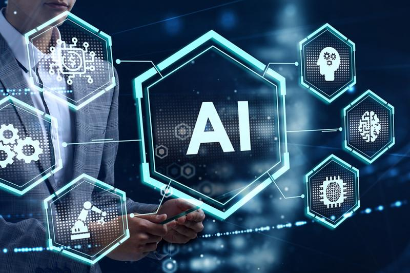

# Pengantar Artificial Intelligence: Memahami Dasar-Dasar Kecerdasan Buatan

{{date}} · {{author}}

Artificial Intelligence atau Kecerdasan Buatan telah menjadi salah satu topik teknologi yang paling banyak dibicarakan dalam dekade terakhir. Dari asisten virtual di smartphone hingga sistem rekomendasi di platform streaming, AI telah menyatu dengan kehidupan kita sehari-hari. Namun, apa sebenarnya AI itu? Bagaimana cara kerjanya? Dan apa dampaknya bagi masa depan kita? Artikel ini akan mengajak Anda memahami dasar-dasar Artificial Intelligence secara komprehensif.

## Apa itu Artificial Intelligence?

Artificial Intelligence (AI) atau Kecerdasan Buatan adalah cabang ilmu komputer yang bertujuan menciptakan sistem yang dapat melakukan tugas-tugas yang biasanya memerlukan kecerdasan manusia. Tugas-tugas ini meliputi pengenalan suara, pengambilan keputusan, persepsi visual, terjemahan bahasa, dan pemecahan masalah kompleks.

Tidak seperti program komputer tradisional yang mengikuti instruksi yang telah ditetapkan secara ketat, sistem AI dirancang untuk belajar dari data, mengenali pola, dan meningkatkan performa seiring waktu. Konsep ini dikenal sebagai machine learning—kemampuan mesin untuk belajar tanpa diprogram secara eksplisit untuk setiap skenario.

## Sejarah Singkat Perkembangan AI

Konsep kecerdasan buatan pertama kali diperkenalkan pada tahun 1956 dalam konferensi Dartmouth, di mana istilah "Artificial Intelligence" secara resmi digunakan. Namun, perjalanan AI tidak selalu mulus. Periode yang dikenal sebagai "AI Winter" terjadi ketika antusiasme awal tidak diikuti oleh hasil yang memenuhi harapan, menyebabkan berkurangnya pendanaan dan minat penelitian.

Kebangkitan AI modern dimulai sekitar tahun 2010-an, didorong oleh tiga faktor utama: ketersediaan data dalam jumlah besar (big data), peningkatan daya komputasi, dan kemajuan algoritma machine learning—terutama deep learning. Perpaduan ini memungkinkan sistem AI mencapai akurasi yang belum pernah terjadi sebelumnya dalam berbagai tugas, dari pengenalan gambar hingga pemrosesan bahasa alami.

## Jenis-Jenis AI Berdasarkan Kemampuan

Para ahli umumnya mengklasifikasikan AI ke dalam beberapa tingkatan berdasarkan kemampuannya:

**AI Sempit (Narrow AI)** adalah bentuk AI yang paling umum saat ini. Sistem ini dirancang untuk melakukan tugas spesifik, seperti mengenali wajah dalam foto, mengalahkan manusia dalam permainan catur, atau merekomendasikan produk. Meskipun unggul dalam domain tertentu, Narrow AI tidak dapat menerapkan pengetahuannya ke situasi yang berbeda.

**Artificial General Intelligence (AGI)** adalah AI hipotetis yang memiliki kemampuan kognitif setara dengan manusia. Sistem AGI dapat memahami, belajar, dan menerapkan pengetahuannya ke berbagai domain—sesuatu yang belum tercapai hingga saat ini.

**Artificial Superintelligence (ASI)** merujuk pada AI yang melebihi kecerdasan manusia dalam segala aspek. Konsep ini tetap menjadi subjek perdebatan filosofis dan etis di kalangan peneliti.

## Aplikasi AI dalam Kehidupan Sehari-hari

Anda mungkin tidak menyadari seberapa sering Anda berinteraksi dengan teknologi AI setiap hari. Berikut beberapa contoh aplikasi praktis:

Asisten virtual seperti Siri, Google Assistant, dan Alexa menggunakan pemrosesan bahasa alami (NLP) untuk memahami perintah lisan dan merespons dengan tindakan atau informasi yang relevan. Sistem rekomendasi di Netflix, Spotify, dan marketplace e-commerce memanfaatkan algoritma machine learning untuk mempersonalisasi konten berdasarkan preferensi pengguna.

Dalam bidang kesehatan, AI membantu mendeteksi penyakit dari citra medis, meramalkan wabah, dan mengoptimalkan penemuan obat-obatan baru. Industri otomotif mengembangkan kendaraan otonom yang mengandalkan computer vision dan sensor untuk navigasi aman.

## Machine Learning dan Deep Learning

Machine Learning (ML) adalah fondasi dari sebagian besar aplikasi AI modern. Algoritma ML memungkinkan sistem untuk belajar dari data melalui tiga pendekatan utama: pembelajaran terawasi (supervised learning), pembelajaran tidak terawasi (unsupervised learning), dan pembelajaran penguatan (reinforcement learning).

Deep Learning, subset dari machine learning, menggunakan arsitektur jaringan saraf tiruan yang terinspirasi dari struktur otak manusia. Dengan banyaknya lapisan "neuron" buatan, deep learning mampu mempelajari representasi data yang sangat kompleks—yang menjelaskan keberhasilannya dalam pengenalan gambar, terjemahan mesin, dan pengenalan suara.

## Tantangan dan Pertimbangan Etis

Seiring berkembangnya AI, muncul berbagai tantangan yang perlu ditangani. Masalah bias algoritma dapat memperkuat ketidakadilan yang ada dalam data pelatihan. Privasi data menjadi perhatian serius ketika sistem AI memproses informasi pribadi dalam skala besar. Dampak terhadap lapangan pekerjaan juga menimbulkan pertanyaan tentang masa depan pekerjaan di era otomasi.

Komunitas peneliti dan pembuat kebijakan semakin menyadari pentingnya pengembangan AI yang bertanggung jawab—mengutamakan transparansi, keadilan, dan akuntabilitas dalam setiap inovasi.

## Masa Depan Artificial Intelligence

Masa depan AI tampak cerah sekaligus penuh ketidakpastian. Kita dapat mengharapkan AI yang lebih terintegrasi dalam pendidikan, memperpersonalisasi pembelajaran sesuai kebutuhan setiap siswa. Di bidang kreatif, alat generatif AI akan terus berkembang, membantu manusia dalam proses desain, penulisan, dan produksi konten.

Yang jelas, pemahaman dasar tentang AI tidak lagi menjadi kebutuhan hanya bagi para insinyur—melainkan keterampilan yang semakin penting bagi siapa saja yang ingin tetap relevan di dunia yang terus berubah. Dengan memulai dari pengantar ini, Anda telah mengambil langkah pertama dalam menjelajahi dunia Artificial Intelligence yang menarik ini.

## Referensi

- Russell, S., & Norvig, P. (2020). *Artificial Intelligence: A Modern Approach*
- [OpenAI Research](https://openai.com/research)
- [Google AI Blog](https://ai.googleblog.com)
